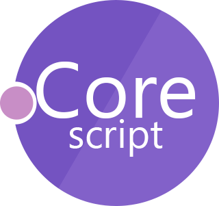

# CoreScript 
A dynamically typed, functional-first, object-oriented, concurrent, general-purpose, embeddable scripting and programming language (for dotnet core 2.0).  

CoreScript is written in F# (www.fsharp.org).  

## [Documentation](./Docs/index.md) (in progress)

## Compilation

As easy as it can be with .net core:  
Install dotnet core 2.0 (https://docs.microsoft.com/en-US/dotnet/core/).  

- Download or clone this repository.  
- open a terminal and goto `Source` - folder
- run `dotnet build`
- verify installation
  + run `dotnet test ../Test` - will run the NUnit - test -project
  + run `dotnet run Script/all-tests.cor` - will run the corescript-tests

## Build

To create the executable use `dotnet publish` (see https://docs.microsoft.com/en-US/dotnet/core/tools/dotnet-publish?tabs=netcore2x)

## Current Status

**!!! NOT READY FOR PRODUCTION !!!**

- Parser: *Alpha-State*
- Interpreter: *Alpha-State*
- Runtime: *in development*
- JIT-Compiler: *not started* (currently syntax-tree-interpreter only)

## TODOs

- Bit-Operations via Operators
- file path handling for `import`
- Runtime
    + Http 
        - request-method fot HTTP-clients
    + Strings
        - match-method (regular expressions)
        - format-method (like sprintf)
        - support other encodings than UTF-8
    + Assert-Module: implement more than just `assert(<true/false>, <error message>)` (e.g. equal, notEqual, throws, etc.)
    + print: fix escape characters (currently not working)
    + Buffer-Module
    + Console-Module
    + Crypto-Module
    + Date-Module
    + JSON/XML-Serialization-Modules
    + Streams-Module
    + Supervisor-Module (to control agents)
    + ZLib-Module
- Packaging and importing modules via NuGet (or other?)
- JIT-compilation via MSIL

## Future 

- WebAssembly backend
- .NET-FFI
- C/C++-FFI

## Syntax Highlighting

A tmLanguage-Definition is [included in this repository](../Lang/language) for Visual Studio Code.  
For now, you can simply copy&paste the *corescript-0.1*-folder into you VSCode-Extensions folder.

## Contribution

I'd be very happy about any contributions to the project, as long as these rules are followed:

- for now, F# only
- no further dependencies
- target dotnet core 2.0
- KISS
- add test

## License

This project is licensed under the [Apache 2.0 License](./LICENSE)